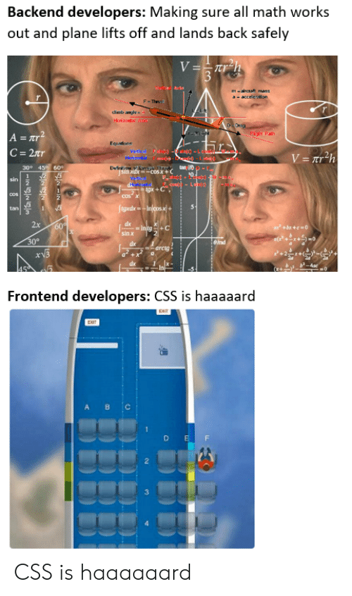

# Konkurs algorytmiczny - September Complexity

## Cel

Konkurs polega na rozwiązaniu zadania Network Cabling (https://www.codingame.com/ide/puzzle/network-cabling) na platformie Codingame.
W treści zadania znajduje się dziewięć przypadków testowych. Wszystkie testy muszą przechodzić!

## Lokalnie

Jeżeli ktoś woli pracować lokalnie, to może sklonować/sforkować to repozytorium. 
Należy poprawnie zaimplementować metodę `minimumLength` w klasie `NetworkCablingService`.
Przypadki testowe zawarte są w klasie `NetworkCablingServiceTest`. 
Polecenie `mvn test` wykonuje wszystkie testy.

Uwaga: na platformie Codingame do przekazywania danych używane jest standardowe wejście/wyjście. 
Klasa `NetworkCablingService` używa parametrów. 
Po zakończeniu pracy lokalnej zadanie należy dostosować do Codingame i sprawdzić, czy wszystkie testy przechodzą.

## Prolog

